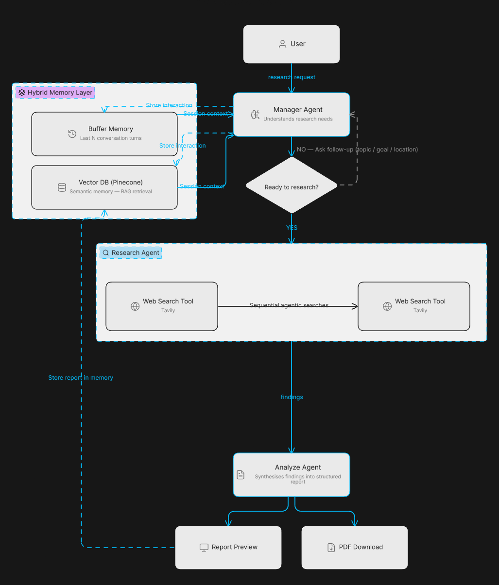

# Explorion — Intelligent Research Platform

> Research anything. Get real-time, up-to-date answers you can trust.

**Explorion** is an open-source agentic AI research platform that goes beyond what a standard LLM can do. Regular AI models answer from their training data — which can be months or years out of date. Explorion actively searches the web in real time, synthesises findings, and delivers a comprehensive, current research report on any topic you ask about.

---

## Why Explorion?

| Standard LLM | Explorion |
|---|---|
| Answers from old training data | Searches the web in real time |
| Knowledge cutoff — can be outdated | Always up to date |
| Generic, one-shot responses | Structured deep research report |
| No memory of your session | Hybrid memory across the conversation |
| Static output | Downloadable PDF report |

Whether you're researching a market opportunity, exploring a scientific topic, analysing competitors, investigating health information, or satisfying curiosity about any subject — Explorion gives you a researched, sourced, and structured answer rather than a guess from stale training data.

---

## Features

### Conversational Research Setup
Explorion doesn't just take a vague query and run with it. It holds a natural conversation to understand exactly what you need — asking for your topic, goal, and optional location — before starting deep research. You stay in control of what gets researched.

### Real-Time Web Research
The research agent uses live web search (Tavily) to scrape up-to-date information from the internet. Every report is built from current data, not cached knowledge.

### Agentic Multi-Step Pipeline
Built on **LangGraph**, the pipeline runs as an autonomous agent workflow:
1. **Manager Agent** — understands your research needs through conversation
2. **Research Agent** — performs sequential web searches, following up each result with targeted queries
3. **Analyze Agent** — synthesises all findings into a structured Markdown report

### Hybrid Memory (Buffer + Vector DB)
Explorion remembers your session through two layers of memory:
- **Buffer Memory** — keeps the last few conversation turns for immediate context
- **Semantic Memory (Vector DB)** — stores past interactions in Pinecone, retrieved via embedding similarity so relevant context from earlier in your session is always available

### Live Research Context Sidebar
The app includes a collapsible sidebar that shows your current research context — topic, goal, and location — updating in real time as the conversation progresses. You can also start a fresh research session at any time using the **New Research Session** button in the sidebar, which clears all context and memory for a clean start.

### Structured Research Reports
Every research run produces a well-formatted Markdown report with executive summary, key findings, risks, and a conclusion — downloadable as a **PDF** directly from the UI.

### Full Pipeline Tracing
Every session and interaction is tracked in **LangSmith** for transparency and debugging, with session-level grouping so your entire research conversation appears as one trace.

### Fully Local LLMs
All AI inference runs locally via **Ollama** — no data sent to external LLM providers. Only web searches and API keys for Tavily, Pinecone, and LangSmith leave your machine.

---

## Architecture

---

## Tech Stack

| Component | Technology |
|---|---|
| Pipeline orchestration | LangGraph |
| LLM framework | LangChain |
| Local LLMs | Ollama (qwen2.5:7b default) |
| Web search | Tavily |
| Vector memory | Pinecone |
| Embeddings | BAAI/bge-small-en-v1.5 (local) |
| Pipeline tracing | LangSmith |
| UI | Streamlit |
| PDF export | fpdf2 |

---

## Quick Start

See **[HowToRun.md](HowToRun.md)** for full setup instructions including:
- Installing Ollama and pulling models
- Installing Docker (for the container option)
- Setting up your free API keys (Pinecone, Tavily, LangSmith)
- Running via Docker or locally with Streamlit
- Model customization options

---

## Open Source

Explorion is free and open source.

**Created by:**
- GitHub: https://github.com/me-Afzal/
- LinkedIn: https://linkedin.com/in/afzal-a-0b1962325

Contributions, issues, and feedback are welcome.
